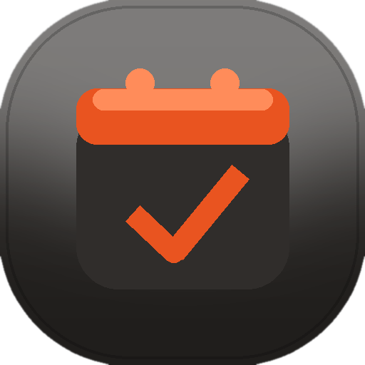

  

<h1 align="center">Nobat Mobile</h1>

  <strong>Clinic appointments on your phone — no server required.</strong> 
  Local accounts · calendar · SMTP reminders · FA / EN

  <em>Latest pre-release: <a href="https://github.com/PouryaFA81/Nobat-Mobile/releases/tag/v0.14.0">v0.14.0</a></em>

---

## Who it’s for

Small clinics, counselors, and front-desk teams who want a **simple appointment book on Android** — without renting a VPS or learning Docker.

If you already self-host the original [Nobat](https://github.com/PouryaFA81/Nobat) server, keep that for privacy-first hosting. **Nobat Mobile** is the sibling product for people who just want an app on the phone.

## What’s in the app (v0.14.0)

- **Local accounts** — Several profiles on one phone; password for create/change only; unlock with PIN/fingerprint; data stays on the device  
- **Personnel** — Staff list (name, email, phone); book **Assign to** so SMTP confirmation + 1h reminder go to that person  
- **App lock** — PIN (auto-submit), optional fingerprint, and **Lock after** (5 / 30 min, 1 hour, or when phone locks)  
- **Calendar** — Month grid → day list; book, cancel, empty-day CTA  
- **Jalali in Persian** — FA uses the solar calendar (week starts شنبه); English stays Gregorian  
- **Language** — فارسی (RTL) / English (LTR), including chrome and strings  
- **Theme** — Dark (default) or Light  
- **Email (SMTP)** — Save your mailbox, test send, confirmation on book, reminder **1 hour before**  
- **SMS** — Opens your phone’s SMS app with a prefilled message (you tap Send)  
- **Account hub** — Scrollable sections: Account Management, Preferences, Advanced Settings, About  
- **About** — Version, check for updates, GitHub contact links  
- **Local Backup & Restore** — Advanced Settings → Backup: save this account’s data to Downloads; restore from a file with a confirm dialog  
- **Reports & Print PDF** — Advanced Settings → Reports: day/month range; on-device PDF; Share / Print  
- **Telegram** — Integrations: your bot token + chat ID; Test send; optional notify on book (staff name + appointment in message)  
- **Role & My schedule** — Admin / Secretary or Staff; link to personnel; Admin Everyone + My schedule tabs; Staff My schedule only (no FAB); local notify on book/cancel  
- **Clinic notifications** — Admin Relay + shareable Clinic code; Staff paste code → Connect; in-app alerts for assigned appointments (SMTP/Telegram stay extras)  
- **Coming soon (shells)** — Bale, Google Drive, Google Calendar, Drive backup  

Next: Drive sync and the remaining shells.

## Nobat vs Nobat Mobile

| | **Nobat** (server) | **Nobat Mobile** (this app) |
|---|---|---|
| Where it runs | Your own server + browser/PWA | Android phone |
| Best for | Privacy-first self-hosting | Everyday use without IT |
| Data | Server + browser | On-device (Room), per local account |
| Notifications | Self-hosted options | Your SMTP + device SMS |
| Install | Docker + domain | APK / Play (when ready) |

Same idea — appointments for a small practice. Different home.

## Email (SMTP) setup

Reminders use **your** mailbox. Step-by-step for Gmail, Outlook, Yahoo, and custom hosts:

- English: **[SMTP setup guide](docs/SMTP.md)**
- فارسی: **[راهنمای راه‌اندازی SMTP](docs/SMTP.fa.md)**

In the app: **Account → Notifications → Email (SMTP)** → **SMTP setup guide**.

## Telegram setup

Notify staff with **your** bot (token + chat ID). Create a bot with [@BotFather](https://t.me/BotFather), get a chat ID, then paste them under Integrations.

- English: **[Telegram setup guide](docs/TELEGRAM.md)**
- فارسی: **[راهنمای راه‌اندازی تلگرام](docs/TELEGRAM.fa.md)**

In the app (from **0.12.0**): **Account → Advanced Settings → Integrations → Telegram** → **Telegram setup guide**.

## Clinic notifications (multi-phone)

Staff get **in-app** alerts via a **Clinic code** (your existing ntfy host + a **new topic** — friend’s Nobat topics untouched):

- English: **[Clinic notifications setup](docs/CLINIC-NOTIFICATIONS.md)**
- فارسی: **[اعلان‌های مطب](docs/CLINIC-NOTIFICATIONS.fa.md)**

In the app (from **0.14.0**): **Clinic code** under Advanced Settings. The UI never says “ntfy.”

## Try it on your phone

### Option A — download the APK (recommended)

1. Open [Releases → v0.14.0](https://github.com/PouryaFA81/Nobat-Mobile/releases/tag/v0.14.0) (or the latest pre-release)
2. Download the `.apk`
3. On your phone, allow install from that source
4. Open **Nobat Mobile**, create or unlock a local account, then use the calendar

### Option B — run from a computer

You need a computer and a USB cable.

1. Install [Android Studio](https://developer.android.com/studio) (free).
2. Open this project: **File → Open** → the folder you cloned from GitHub (`Nobat-Mobile`).
3. On your phone: **Settings → About phone** → tap **Build number** seven times → go back → **Developer options** → turn on **USB debugging**.
4. Plug the phone into the computer and accept the debugging prompt on the phone.
5. In Android Studio, press **Run** ▶ and choose your phone.

The first sync can take a few minutes.

## Status

Pre-release dogfood builds. Booking, accounts, roles/My schedule, clinic notifications, app lock, language, SMTP reminders, Telegram, and themes are in **v0.14.0**. See [CHANGELOG](CHANGELOG.md) and [Releases](https://github.com/PouryaFA81/Nobat-Mobile/releases) for the full trail.

Want the self-hosted edition instead? → **[Nobat](https://github.com/PouryaFA81/Nobat)**

## License

[GNU Affero General Public License v3.0](LICENSE) — same family as [Nobat](https://github.com/PouryaFA81/Nobat).

---

  Nobat Mobile · appointment scheduling for clinics, on Android

